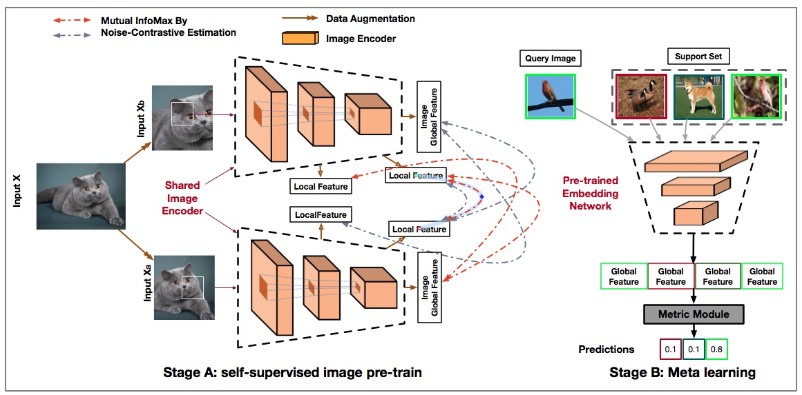
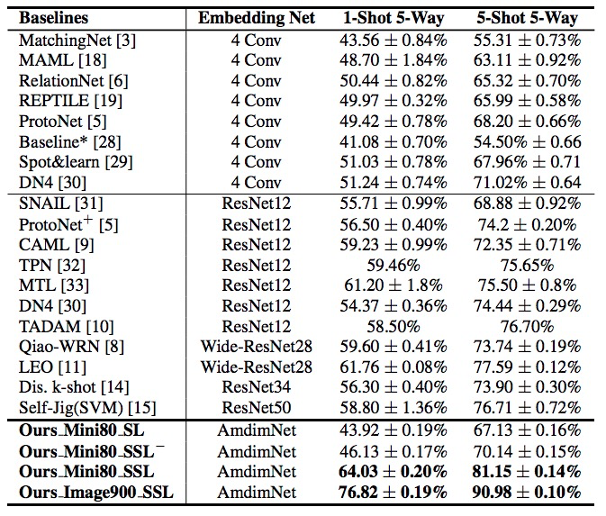

# Self-Supervised Learning For  Few-shot Image Classification
This repository contains a PyTroch implementation of the algorithm presented in the paper Self-Supervised Learning For Few-shot Image Classification. [https://arxiv.org/abs/1911.06045](https://arxiv.org/abs/1911.06045)
## Few-Shot Learning &  Self Supervised Learning

Few-shot image classification aims to robustly classify unseen classes with limited samples for each class. Recent works benefit from the meta-learning process with episodic tasks and can fast adapt to class change from training to testing. Due to the limited number of samples in each task, the initial embedding network for meta learning becomes an essential component of the network and can largely affects the classification performance in practice. Recent advanced methods based on pre-trained embedding network have significantly improved the state-of-the-art results in different few-shot classification datasets. These methods, however, are highly relied on the quality of the embedding network. In this paper, we proposed a novel method which includes a more generalized embedding network under self-supervised learning(SSL) and tackle the 'curse of layers issue' in few-shot learning.



## Prerequisites
The following packages are required to run the scripts:
- [PyTorch-1.0 and torchvision=0.2.2](https://pytorch.org)
- Package [tensorboardX](https://github.com/lanpa/tensorboardX)

## Result

## Usage

### Pre-Trained Models

### MiniImagenet

| ModelName   |      Model Arch      |   Mode URL |
|:----------:|:-------------:| :-------------:|
| mini80_ssl |   ndf=192, rkhs=1536, rd=8 (SSL) |   [mini_imagenet_ndf192_rkhs1536_rd8_ssl_cpt.pth](https://drive.google.com/open?id=1dY2opsfmm6FeFaQ0rFu5ScfqKC-oPYCB)    |
| mini80_sl |   ndf=192, rkhs=1536, rd=8 (SL) |    [mini_imagenet_ndf192_rkhs1536_rd8_sl_cpt.pth](https://drive.google.com/open?id=1Qo5zbYWQpYyYqhEoSf7k8pSmRPLE75y3)    |
| imagenet900_ssl | ndf=192, rkhs=1536, rd=8 (SSL)   |  [imagenet900_ndf192_rkhs_1536_rd8_sl_cpt.pth](https://drive.google.com/open?id=1QAidG83wLNkHpSkcO9s_3WfRJ0xQINKJ) |

### CUB

| ModelName   |      Model Arch      |    Mode URL |
|:----------:|:-------------:| :-------------:|
| cub150_ssl | ndf=192, rkhs=1536, rd=8 (SSL) |  [cub_ndf192_rkhs1536_rd8_ssl_cpt.pth](https://drive.google.com/open?id=1odZTinAFfhg0_5nC-yyyVednDWRvfOZM)|
| cub150_sl | ndf=192, rkhs=1536, rd=8 (SL) |  [cub_ndf192_rkhs1536_rd8_sl_cpt.pth](https://drive.google.com/open?id=1MGlleWiQ28V-_fL8nj33iIxgh5jiBLVy) |
| imagenet1000_ssl |   ndf=192, rkhs=1536, rd=8 (SSL) |   [imagenet1K_ndf192_rkhs_1536_rd8_ssl_cpt.pth](https://drive.google.com/open?id=1NeEyV3YgsLAj4zWvLAjcATgeEe3blIh3) |


### Training
Example of train miniimagenet from mini80_ssl
```bash
python train_protonet.py --lr 0.0001 --temperature 128   \
--max_epoch 100 --model_type AmdimNet --dataset MiniImageNet \
--init_weights ./saves/initialization/miniimagenet/mini_imagenet_ndf192_rkhs1536_rd8_ssl_cpt.pth  \
--save_path ./MINI_ProtoNet_MINI_1shot_5way/ \
--shot 1  --way 5 --gpu 4 --step_size 10 --gamma 0.5 \
--ndf 192 --rkhs 1536 --nd 8
```

## References
[Learning Representations by Maximizing Mutual Information Across Views](https://arxiv.org/abs/1906.00910)

[Learning Embedding Adaptation for Few-Shot Learning](https://arxiv.org/abs/1812.03664)

## Citation
```
@article{chen2019selfsupervised,
    title={Self-Supervised Learning For Few-Shot Image Classification},
    author={Da Chen and Yuefeng Chen and Yuhong Li and Feng Mao and Yuan He and Hui Xue},
    Journal={arXiv preprint arXiv:1911.06045},
    year={2019}
}
```
## Contact
For questions please contact Yuefeng Chen at yuefeng.chenyf@alibaba-inc.com.

## Acknowledgements
This code is built on [FEAT](https://github.com/Sha-Lab/FEAT) (PyTorch) and [AMDIM](https://github.com/Philip-Bachman/amdim-public) (PyTorch). We thank the authors for sharing their codes.
